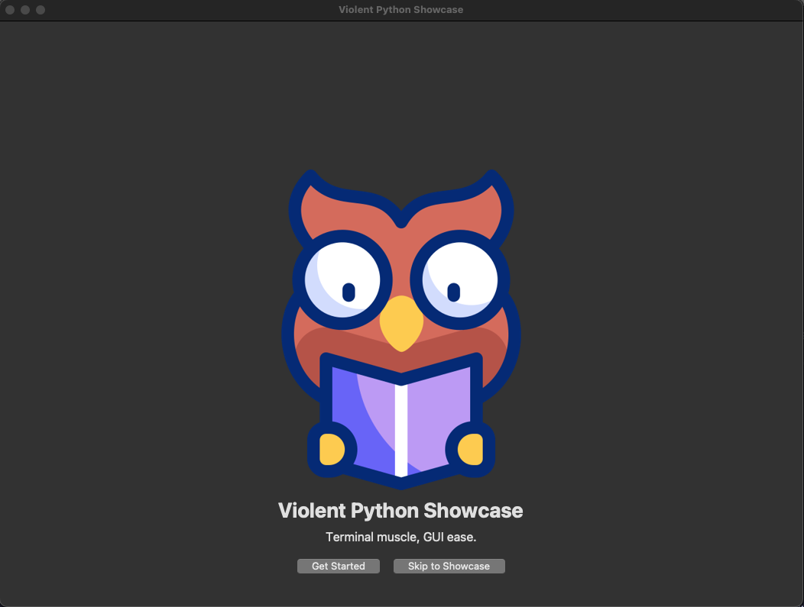
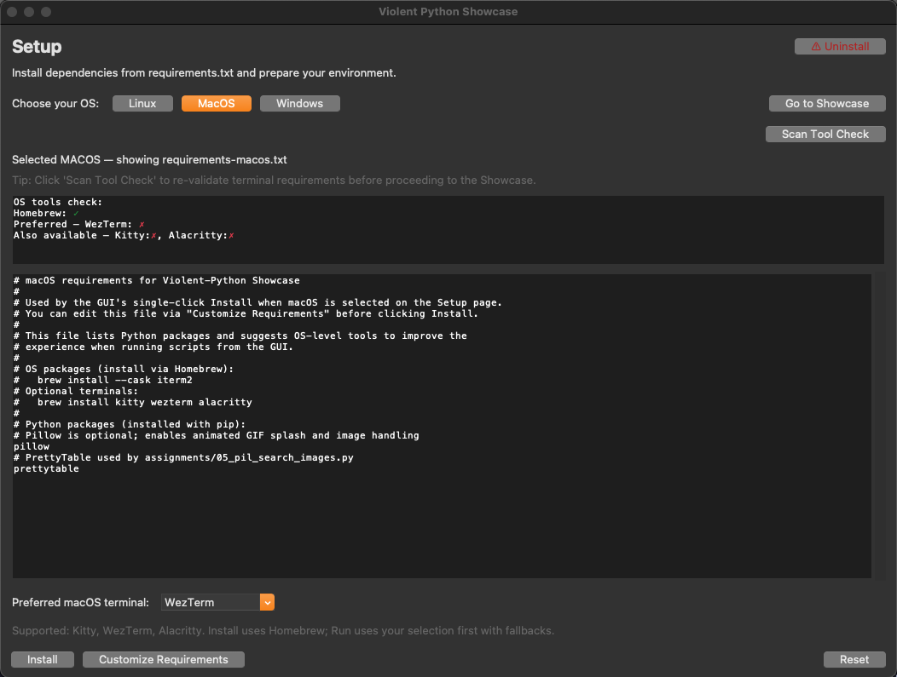
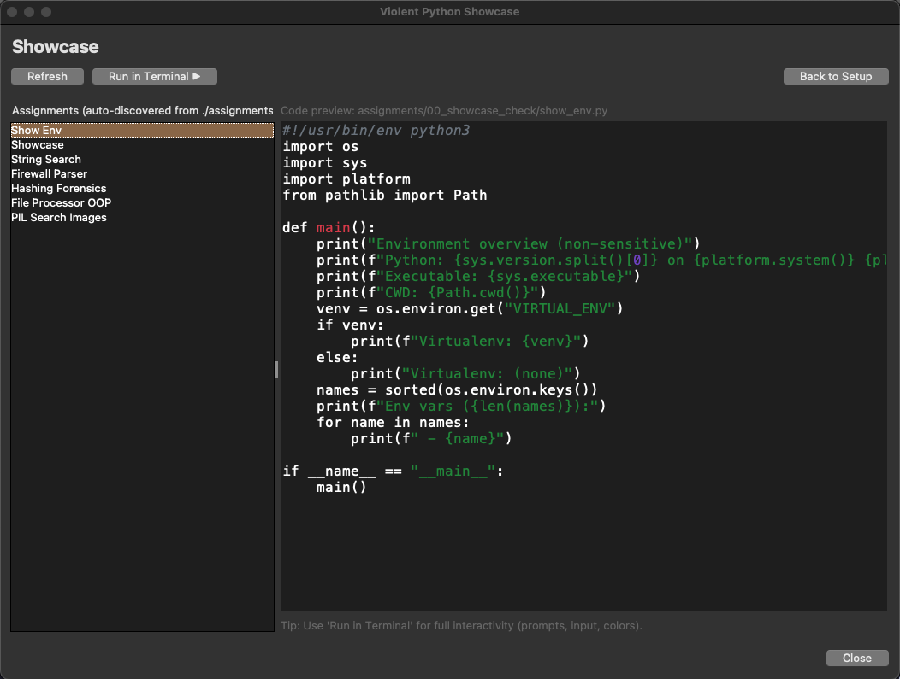

# Violent Python: Cybersecurity Script Showcase  <p align="right">

<p align="left">
  <a href="#"></a>
  <a href="#"></a>
  <a href="#"></a>
  <a href="LICENSE"></a>
  <a href="#"></a>
  <a href="#"></a>
  <a href="#"></a>
  <a href="#"></a>
</p>

A curated portfolio of small, self-contained Python scripts for cybersecurity coursework with a Tkinter GUI to browse, preview, and run them.

> _For educational use only. Do not use these scripts to violate policies or laws._ ⚠️

---

## 📑 Table of contents

- 🚀 Quick start
- 🧭 Assignments
- 🖥️ GUI Showcase
- 📦 Dependencies
- 🗂️ Repository structure
- 🖼️ Screenshots
- 🧩 Troubleshooting
- ❓ FAQ
- 📖 Academic integrity
- 📜 License

---

## 🚀 Quick start

- macOS/Linux (recommended):
  ```bash
  ./start.sh
  ```
- Windows (PowerShell):
  ```powershell
  ./start.ps1
  ```
- Manual (any OS):
  ```bash
  python3 -m venv .venv
  source .venv/bin/activate  # Windows: .venv\Scripts\Activate.ps1
  python -m pip install -r requirements.txt
  python main.py
  ```

Notes
- _The Setup screen can preview and install OS-specific requirement files (requirements-<os>.txt)._ 
- _The Showcase screen auto-discovers `./assignments/*/*.py`, previews code, and runs selected scripts in your preferred terminal._
- _Splash image: looks for (animated) `assets/logo.gif` first, then `assets/logo.png`._

---

## 🧭 Assignments

Run any script from the repo root.

| ID | Name | Run | Notes |
|----|------|-----|-------|
| 00 | <small>Showcase checks</small> | <small>`python3 assignments/00_showcase_check/show_env.py`<br>`python3 assignments/00_showcase_check/showcase.py`</small> | <small>Quick environment and demo scripts</small> |
| 01 | <small>String search</small> | <small>`python3 assignments/01_string_search/01_string_search.py`</small> | <small>Basic string analysis</small> |
| 02 | <small>Firewall log parser</small> | <small>`python3 assignments/02_firewall_parser/02_firewall_parser.py [redhat.txt]`</small> | <small>Needs `redhat.txt` in current directory, or pass a path</small> |
| 03 | <small>Hashing forensics (MD5)</small> | <small>`python3 assignments/03_hashing_forensics/03_hashing_forensics.py [-d <dir>]`</small> | <small>Defaults to `testImages` next to script; target a small folder</small> |
| 04 | <small>File processor (interactive)</small> | <small>`python3 assignments/04_file_processor_oop/04_file_processor_oop.py`</small> | <small>Prompts for a directory</small> |
| 05 | <small>Image inspection</small> | <small>`python3 assignments/05_pil_search_images/05_pil_search_images.py`</small> | <small>Install Pillow + PrettyTable first (`-r requirements.txt`)</small> |
| 06 | <small>EXIF geotag extractor</small> | <small>`python3 assignments/06_exif_geotag_extractor/06_exif_geotag_extractor.py`</small> | <small>Scans JPEGs for EXIF GPS; outputs table and CSVs</small> |
| 07 | <small>Memory regex extract</small> | <small>`python3 assignments/07_memory_regex_extract/07_memory_regex_extract.py assets/test.bin`</small> | <small>Extracts e-mails and URLs from a memory dump; optional JSON</small> |
| 08 | <small>Memory unique strings</small> | <small>`python3 assignments/08_memory_unique_strings/08_memory_unique_strings.py assets/test.bin`</small> | <small>5–15 letter strings with occurrence counts (PrettyTable)</small> |
| 09 | <small>Web crawler & scraper</small> | <small>`python3 assignments/09_web_crawler_scraper/09_web_crawler_scraper.py https://example.edu/ --depth 1`</small> | <small>Same-site crawl; prints titles/links; downloads on-site images</small> |
| 10–20 | <small>Placeholders</small> | <small>-</small> | <small>Reserved for future assignments</small> |

---

## 🖥️ GUI Showcase (Tkinter)

- Install/preview OS-specific requirements.
- One-click Install: sets up your preferred terminal per OS and runs `pip install -r` for the selected requirements file.
- Auto-discovers `./assignments/*/*.py`.
- Previews syntax-highlighted code.
- Runs a selected script in your preferred terminal.

Preferences are stored in `.vp_showcase_prefs.json`.

### Safe Uninstall

<details>
<summary>How uninstall works (click to expand)</summary>

- Double confirmation (you must type the exact folder name).
- Prefers moving the project folder to the OS Trash/Recycle Bin when possible:
  - macOS: Finder Trash
  - Windows: Recycle Bin API
  - Linux: `gio trash` when available
- If Trash is unavailable, falls back to a non-destructive safe rename: `<folder>.DELETE_ME_YYYYmmdd`.
- Strong safety checks ensure the target is this repo (looks for markers like `main.py` and `README.md`.
- Never modifies system tools or packages (Python, Homebrew, winget, etc.).

Smoke test available:

- macOS/Linux:
  ```bash
  python3 scripts/e2e_uninstall_smoke.py
  ```
- Windows (PowerShell):
  ```powershell
  py -3 scripts\e2e_uninstall_smoke.py
  ```

</details>

---

## 📦 Dependencies

Mostly standard-library Python. Third-party packages used by some scripts:
- Pillow (optional) for images/splash animation
- PrettyTable for tabular CLI output (Assignment 05)

OS-specific requirement files:
- requirements-macos.txt
- requirements-linux.txt
- requirements-windows.txt

The top-level `requirements.txt` is intentionally minimal.

---

## 🗂️ Repository structure

<details>
<summary>Expand to view</summary>

```
Violent-Python/
├─ main.py                     # Tkinter GUI to run/preview assignments
├─ start.sh                    # macOS/Linux launcher (creates .venv, checks Tk)
├─ start.ps1                   # Windows launcher (creates .venv, checks Tk)
├─ assignments/
│  ├─ 00_showcase_check/
│  ├─ 01_string_search/
│  ├─ 02_firewall_parser/
│  ├─ 03_hashing_forensics/
│  ├─ 04_file_processor_oop/
│  ├─ 05_pil_search_images/
│  ├─ 06_exif_geotag_extractor/   # placeholder
│  ├─ 07_memory_regex_extract/    # placeholder
│  ├─ 08_memory_unique_strings/   # placeholder
│  ├─ 09_web_crawler_scraper/     # placeholder
│  ├─ 10_tcp_server/              # placeholder
│  ├─ 11_tcp_client/              # placeholder
│  ├─ 12_packet_sniffer/          # placeholder
│  ├─ 13_pcap_asset_mapping/      # placeholder
│  ├─ 14_lsb_steganography/       # placeholder
│  ├─ 15_hashtag_collector/       # placeholder
│  ├─ 16_social_graph_harvest/    # placeholder
│  ├─ 17_nltk_transcript_analysis/# placeholder
│  ├─ 18_mp3_id3_carver/          # placeholder
│  ├─ 19_virustotal_client/       # placeholder
│  └─ 20_tbd/                     # placeholder
├─ assets/
│  ├─ logo.png
│  ├─ pylogo.png
│  └─ screenshots/
│     ├─ splash.png               # example screenshot
│     └─ README.md
├─ requirements*.txt
├─ .github/workflows/close-prs.yml
├─ LICENSE
├─ README.md
└─ WARP.md
```

</details>

---

## 🖼️ Screenshots

---

---

---

## 🧩 Troubleshooting

- Tkinter not available
  - macOS: install Python from python.org or `brew install python`, then recreate `.venv`.
  - Linux: install `python3-tk` (Debian/Ubuntu) or `python3-tkinter` (Fedora/RHEL) and recreate `.venv`.
  - Windows: install Python 3 (includes Tk) and recreate `.venv`.

---

## ❓ FAQ

- How do I run scripts without the GUI?
  - Use the commands in the Assignments table from the repo root. A virtual environment is optional but recommended.
- Why isn’t the splash animated?
  - Animated splash requires `assets/logo.gif` and Pillow installed. If only `assets/logo.png` exists or Pillow isn’t installed, it will show a static image.
- Where do screenshots go?
  - Place screenshots in `assets/screenshots/`. The README references `Splash.png`, `Setup.png`, and `Showcase.png`.
- How do I uninstall safely?
  - In the GUI, use Setup → Uninstall. See “Safe Uninstall” above. It moves the folder to Trash/Recycle Bin when possible, or safely renames it.

---

## 🤝 Contributing

PRs are closed; please fork to propose changes.

---

## 📖 Academic integrity and responsible use

This repository documents my learning. It should not be used to violate the
[UA Code of Academic Integrity](https://deanofstudents.arizona.edu/policies/code-academic-integrity)
or any applicable laws/policies. Keep submissions independent unless collaboration is explicitly allowed and cite sources.

---


## 📜 License

This project is licensed under the MIT License — see [LICENSE](LICENSE).

---

See the project [CHANGELOG](CHANGELOG.md) for release notes.
